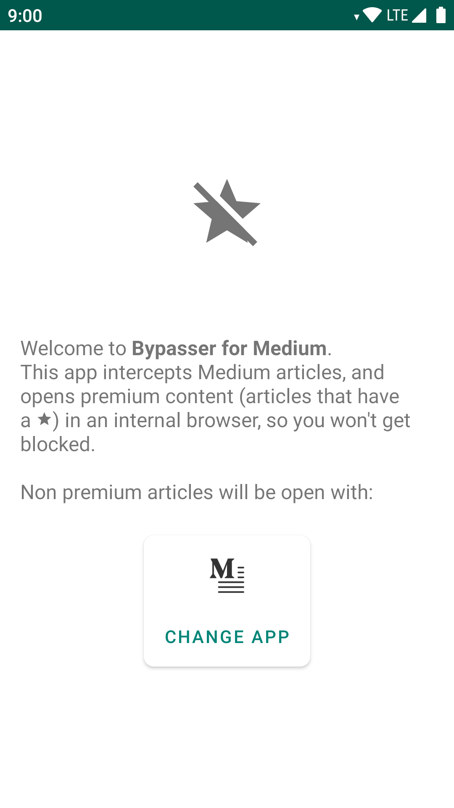

<h2 align="center"><b>Bypasser for Medium</b></h2>
<h4 align="center">An Android app that intercepts Medium articles, and opens them internally if they're premium.</h4>

## Download
You can download the APK file [here](https://github.com/grivos/BypasserForMedium/releases/download/v1.0.1/bypasser_v1.0.1.apk).

## Screenshots

## Acknowledgements

The architecture of the app is based on [Android-Kotlin-Clean-Architecturet](https://github.com/sanogueralorenzo/Android-Kotlin-Clean-Architecture).

## License
  

Bypasser for Medium is a free software: You can use, study, share and improve it at your
will. Specifically you can redistribute and/or modify it under the terms of the
[GNU General Public License](https://www.gnu.org/licenses/gpl.html) as
published by the Free Software Foundation, either version 3 of the License, or
(at your option) any later version. 
